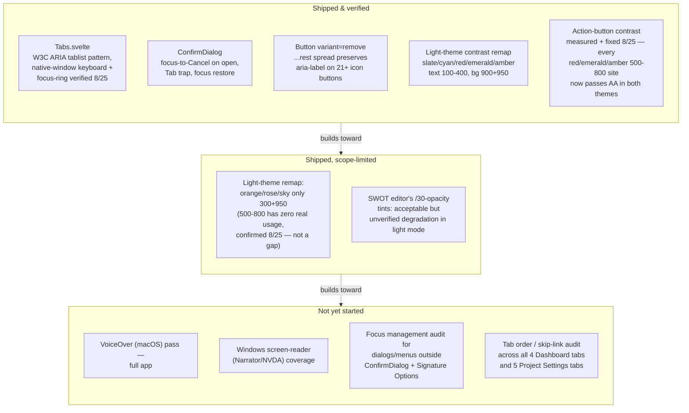

<!--
SPDX-FileCopyrightText: 2026 James L. Burns and The GoPMgr Contributors
SPDX-License-Identifier: GFDL-1.3-or-later
-->

# Accessibility — coverage map and remaining work

**Status:** Planning document, 2026-08-24; updated 2026-08-25 — M1 (native
keyboard-only pass of `Tabs.svelte`'s two consumers) fully closed, in both
the browser-tab and native-window runtimes; action-button contrast (item 5)
fully closed — measured, one bug fixed, and the user's shade-darkening
decision implemented and verified. Maps what accessibility work has
already shipped against what remains, so the two stop being tracked only as
scattered "verification owed" footnotes across `docs/beta-release-backlog.md`
and `session-notes.md`. No implementation in this document — it is the
design/map/plan deliverable ROADMAP.md's "Accessible, keyboard-complete
workflows before broad release" goal has not yet had.

## 1. Why this document exists

Accessibility work has happened incrementally across many unrelated sessions
(light-theme contrast remapping in June, `ConfirmDialog` focus trapping, the
`Tabs.svelte` ARIA tablist built for the Dashboard/Project-Settings IA
restructuring in August). Each was verified and closed in its own backlog
row, but no single place answers "what accessible-interaction coverage does
the app have today, and what's still missing before the ROADMAP's
keyboard-complete/assistive-technology goal is met." This document is that
place. It is a map, not an audit: the rows below are drawn from this
session's grep of `session-notes.md` and `docs/beta-release-backlog.md`, not
from a fresh WCAG pass over the running app.

## 2. Coverage map

## 3. Detail table

| Area | State | Evidence | Gap / next step |
|---|---|---|---|
| Tab navigation (`Tabs.svelte`) | Shipped; fully verified 2026-08-25 | 8 dedicated component tests for keyboard mechanics (`docs/beta-release-backlog.md` Priority #3 R3/R4 row); a 2026-08-25 real-browser pass against the `wails dev` asset server (`http://localhost:34115`, IPC bridge live) confirming trusted OS-level ArrowRight/ArrowLeft/Home/End/Tab keydowns, wraparound both directions, ARIA state, and live `:focus-visible` rendering in both themes; **and, later the same day, a native-window pass through computer-use against the actually-launched `gopmgr.app`** (real macOS window chrome, no browser involved): clicked into each consumer's tablist, then drove ArrowRight through the full cycle plus wraparound in both directions, Home, End, and Tab on both Dashboard's 4 tabs and Project Settings' 5, screenshotting and zooming after each keypress to visually confirm the correct tab activates and a real focus ring renders (the exact `outline: 2px solid` rule from `app.css`), and that Tab exits the tablist into its panel rather than cycling. Zero defects found in either runtime. | None open. Both halves of the plan's original acceptance criterion — "DOM assertions correspond to real focus rings" and "native window chrome doesn't intercept arrow/Tab keys" — are now independently confirmed, in two different runtimes. |
| Confirmation dialogs (`ConfirmDialog`) | Shipped | 12 component tests, fault-seeded initial-focus check | Help text explicitly scopes this guarantee to `ConfirmDialog`-family and Signature Options only — other custom dialogs/menus (chart editors, document editors) are unaudited for the same focus-trap/restore behavior. |
| Icon-only buttons (`Button variant="remove"`) | Shipped | 21 of an unknown larger population of icon buttons migrated with `aria-label` preserved via `...rest` spread. **Correction, 2026-08-25**: this row previously stated `WorkflowEditor`/`ActivityEditor`/`CPMEditor` were "explicitly deferred," carrying forward `beta-release-backlog.md` row 56's 2026-08-18 exclusion reason verbatim into this plan (written 2026-08-24) without re-checking whether it still held. It didn't: those three were actually migrated the very next day (2026-08-19), leaving only their `remove`-variant buttons' *reachability testing* unclosed, not the migration itself — a re-verification failure, not a timing accident, and the same failure mode this correction itself almost repeated before a completeness grep caught it. That reachability gap is now closed across all four `variant="remove"` sites in the trio (`ActivityEditor`'s "Delete edge" and "Remove swimlane," `WorkflowEditor`'s "Delete edge," `CPMEditor`'s "Remove assignment" — `ActivityEditor.test.ts`/`WorkflowEditor.test.ts`/`CPMEditor.test.ts`, 2026-08-25) — and writing the reachable test for "Remove assignment" surfaced a real, independent defect: it had `title` but no `aria-label`, so its computed accessible name came from its bare `✕` text content, not the title, unlike its three siblings. Fixed with a one-line `aria-label` addition, fault-seeded. | None open for this specific trio, confirmed by grep for `variant="remove"` across all three files (not assumed from the original 2-3 sites named). The broader "unknown larger population of icon buttons" beyond the 21 already migrated remains unquantified — a fresh app-wide grep would be needed to know if any remain. |
| Light-theme color contrast | Shipped for core semantic colors; action-button shades measured and fixed 2026-08-25 | `frontend/tailwind.config.js` + `app.css` CSS-variable remap for slate/cyan/red/emerald/amber; **2026-08-25 measurement** (real Tailwind v4.3.3 `npm run build` output, WCAG 2.1 SC 1.4.3 formula, every real `bg-{red,emerald,amber}-[5678]00` call site in `frontend/src`) replaced the "reasoned as sufficient" claim with actual numbers, then every genuinely-failing site was fixed the same day once the user chose "darken the shade" over "restrict to non-text use" — see below for the full ranked table. | orange/rose/sky have **zero real 500-800 usage** (scope correction — the original six-color framing was wrong by half). All real red/emerald/amber sites now pass AA in both themes, both rest and hover. SWOT's transparency tints remain unverified (alpha-compositing math not yet done) — a separate, still-open item. |
| Action-button contrast — measured + fixed detail (2026-08-25) | Done — all 12 real failing sites fixed | **Bucket A — light-theme text-flip bug** (ambient text on a fixed-color background that flipped dark only in light theme): `CharterEditor.svelte:265` (amber-800/700), `CharterEditor.svelte:282` and `Dashboard.svelte:564` (emerald-800/700). Fixed by adding explicit `text-white` — 7.13:1–7.71:1 in both themes, both states.  **Bucket B → merged into the shade decision**: `SprintList.svelte:328` (`bg-emerald-700 hover:bg-emerald-600`, ambient, both themes failing at rest) — user chose "darken the shade," so this became `bg-emerald-800 hover:bg-emerald-700 text-white` (7.71:1/5.43:1), the same treatment as Bucket A.  **Bucket C — the shade decision**: user chose to darken every failing shade one tier rather than restrict them to non-text use. Every `emerald-600`/`amber-600`/`red-500` site that failed regardless of text color was shifted up: `bg-emerald-600→800 hover:emerald-500→700` (`SignCertificateModal.svelte:254`, `CharterEditor.svelte:326`, `SigmaProjectView.svelte:265`), `bg-emerald-600 (ambient, no hover-safe pair)→800/700 + text-white` (`SigmaProjectView.svelte:532`), `bg-emerald-600→700` no-hover single value (`SigmaPhaseStepper.svelte:55`'s completed-phase checkmark glyph — `emerald-700`+white measures 5.43:1, comfortably clearing 4.5:1 regardless of whether the `text-lg` glyph counts as WCAG large text; this is a measured fact about this one site, not a "no hover means one tier is enough" general rule), `bg-amber-600→800 hover:amber-500→700` (`SigmaFishbone.svelte:174`), `bg-red-600→700 hover:red-500→600` (`ProjectPicker.svelte:199` — red only needed one tier since `red-600`/`red-700` already both pass individually), and `Button.svelte:78`'s shared `caution` variant (`amber-700→800 hover:amber-600→700`) — cascading the fix to every `variant="caution"` site app-wide (`AppSettings.svelte:383`, `AdminPanel.svelte:338`) without touching those files directly.  **Correction to the original write-up**: `ReportComposer.svelte:226` (`bg-emerald-700 hover:bg-emerald-600 text-white`) was first listed as "passing, no action needed" — that checked only the rest state (5.43:1 PASS) and missed that its hover state (`emerald-600`+white, 3.73:1) fails independently, the same rest-passes/hover-fails shape as the `Button.svelte caution` bug. Caught by a completeness re-grep after the other fixes landed; darkened the same way (`emerald-800/700`).  `Button.test.ts`'s `caution`-variant test asserted `toContain('bg-amber-700')`, which coincidentally still passed after the shade change since `bg-amber-700` is also a substring of the new `hover:bg-amber-700` — a false-negative risk, not caught by the shade change itself. Rewritten to assert `bg-amber-800` and `hover:bg-amber-700` as distinct tokens; fault-seeded by reverting the variant and confirming the rewritten test fails, then restoring.  **Found via adversarial review, fixed the same day**: `SigmaPhaseStepper.svelte:55`'s completed-phase branch sits two lines above its structurally identical `isCurrent` sibling (line 57), `bg-cyan-600 text-white ring-4 ring-cyan-900` — outside the original red/emerald/amber grep scope, since cyan is a theme-remapped color via `--cyan-*` CSS variables rather than a raw Tailwind shade. Measured anyway once flagged: `cyan-600` (`rgb(8,145,178)`, identical in both themes) + white is 3.68:1, a real failure on the *current*-phase indicator — arguably the more important of the two states. Fixed by bumping to `cyan-700` (`rgb(14,116,144)`, the same value already used as the light-theme focus-ring accent), 5.36:1, theme-independent since cyan's CSS-variable values don't differ between `:root` and `:root[data-theme='light']`.  Passing without any change: `red-700`/`red-600`+white (6.52/4.87), `emerald-700`+white rest only (5.43, superseded above), `amber-700`+white rest only (5.05, superseded above), `Button.svelte`'s `danger` variant (unchanged, already passed both states). Excluded, different pattern, still unverified: progress-bar/stepper fills with no text overlay (`BudgetPanel.svelte:100`, `DORADashboard.svelte:119-122`, `SigmaPhaseStepper.svelte:77` — non-text contrast, SC 1.4.11 not SC 1.4.3); `Portfolio.svelte:66,68,70`'s `/20`-opacity badge tints and `ProjectPicker.svelte:222`'s `hover:bg-red-600/80` translucent overlay (need alpha-compositing math). Methodology: ratios use Tailwind v4's sRGB hex fallback, correct for standard-gamut displays; a wide-gamut (P3) display uses Tailwind's `lab(...)` value instead and would compute a different ratio. Verification: `svelte-check --fail-on-warnings` clean (260 files), `vitest run` 361/361 (unchanged count — one assertion rewritten, none added/removed), production build clean. |
| Cross-platform AT coverage | Not started | `docs/beta-release-backlog.md`'s Cost Control and keyboard-coverage rows both explicitly close with "Native Windows, VoiceOver, and keyboard-only coverage remain planned separately" | This is the largest concrete gap against the ROADMAP goal. No VoiceOver, Narrator, or NVDA pass has been run against any version of this app to date, per the available records. |

## 4. Recommended next accessibility work item

In priority order, scoped to be independently completable:

1. ~~**Native keyboard-only pass of `Tabs.svelte`'s two consumers**~~ — **fully
   closed 2026-08-25.** Split earlier the same day into two halves (browser
   focus-ring verification vs. native window-chrome key interception); a
   same-session attempt to close the second half via computer-use was
   initially denied at the access prompt, then explicitly re-granted by the
   user later the same day. With access granted, both consumers were driven
   through the real, launched `gopmgr.app` window — not a browser tab — with
   real hardware keys, screenshotted and zoomed after each keypress to
   visually confirm the rendered focus ring. See the detail table row above
   for the full evidence. No defects found; nothing left open on this item.
2. ~~**Finish the `Button variant="remove"` migration** for the three
   explicitly-deferred editors, each behind its own small test.~~ —
   **closed 2026-08-25**, see the detail table row above; the premise was
   partly stale (migration itself was already done), the real remaining gap
   (reachability tests, plus one genuine accessible-name defect found along
   the way) is now closed.
3. **VoiceOver smoke pass** covering sign-in, project creation, and one
   document/one chart editor — the three flows every user touches first.
4. **Focus-trap/restore audit of the remaining custom dialogs and menus**
   outside the `ConfirmDialog` family, using the same pattern already proven
   there rather than inventing a new one.
5. ~~**Independent AA contrast measurement of the six action-button shades**
   (500-800 across red/emerald/amber/orange/rose/sky) reasoned-but-not-measured
   in the June remap.~~ — **measured and fixed, 2026-08-25**; see the detail
   table row above. Scope was actually red/emerald/amber only (orange/rose/sky
   have no real usage at these shades). One clear bug (light-theme text-flip
   on ambient text, 3 sites) was fixed immediately. The remaining real,
   both-theme AA failures on `emerald-600`/`amber-600`/`red-500` — including
   the shared `Button.svelte` `caution` variant's hover state, and one site
   (`ReportComposer.svelte:226`) missed in the first pass and caught by a
   completeness re-grep — were a real brand-color decision, referred to the
   user rather than decided unilaterally. **User chose to darken the shade
   one tier** (rather than restrict these colors to non-text use); all 12
   sites fixed the same day, `Button.test.ts`'s coincidentally-still-passing
   assertion corrected and fault-seeded. This item is now fully closed.

Windows/NVDA coverage is deliberately not item 1 — it requires a Windows
host this environment does not have, and should be scheduled once the
macOS-side gaps above are closed so any shared component-level fix isn't
duplicated across two coverage passes.

## 5. Explicitly out of scope for this document

Per the go-high-assurance workflow's scope discipline, this document plans
and maps only. It does not audit the running app, does not fix any of the
gaps above, and does not run a Penpot accessibility-token or contrast audit
— those are the `penpot-audit-accessibility` skill's job, to be invoked
against a design once one exists to audit, or against this coverage map in a
future session focused specifically on accessibility.
