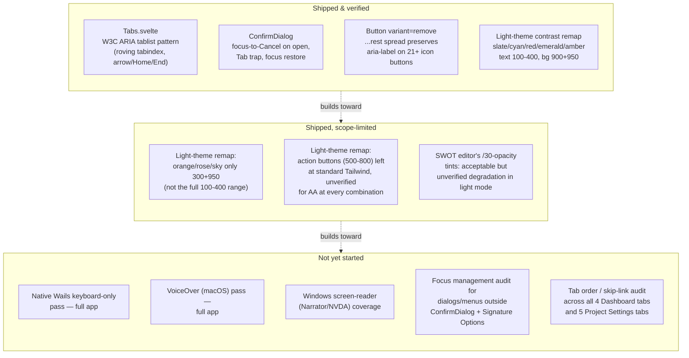

<!--
SPDX-FileCopyrightText: 2026 James L. Burns and The GoPMgr Contributors
SPDX-License-Identifier: GFDL-1.3-or-later
-->

# Accessibility — coverage map and remaining work

**Status:** Planning document, 2026-08-24. Maps what accessibility work has
already shipped against what remains, so the two stop being tracked only as
scattered "verification owed" footnotes across `docs/beta-release-backlog.md`
and `session-notes.md`. No implementation in this document — it is the
design/map/plan deliverable ROADMAP.md's "Accessible, keyboard-complete
workflows before broad release" goal has not yet had.

## 1. Why this document exists

Accessibility work has happened incrementally across many unrelated sessions
(light-theme contrast remapping in June, `ConfirmDialog` focus trapping, the
`Tabs.svelte` ARIA tablist built for the Dashboard/Project-Settings IA
restructuring in August). Each was verified and closed in its own backlog
row, but no single place answers "what accessible-interaction coverage does
the app have today, and what's still missing before the ROADMAP's
keyboard-complete/assistive-technology goal is met." This document is that
place. It is a map, not an audit: the rows below are drawn from this
session's grep of `session-notes.md` and `docs/beta-release-backlog.md`, not
from a fresh WCAG pass over the running app.

## 2. Coverage map

## 3. Detail table

| Area | State | Evidence | Gap / next step |
|---|---|---|---|
| Tab navigation (`Tabs.svelte`) | Shipped | 8 dedicated component tests for keyboard mechanics (`docs/beta-release-backlog.md` Priority #3 R3/R4 row); used by Dashboard (4 tabs) and Project Settings (5 tabs) | Assertion-only proof (`tabindex`, `aria-selected`, `document.activeElement`) — never confirmed with a real focus ring in a real window. **Next: native Wails keyboard pass on both consumers.** |
| Confirmation dialogs (`ConfirmDialog`) | Shipped | 12 component tests, fault-seeded initial-focus check | Help text explicitly scopes this guarantee to `ConfirmDialog`-family and Signature Options only — other custom dialogs/menus (chart editors, document editors) are unaudited for the same focus-trap/restore behavior. |
| Icon-only buttons (`Button variant="remove"`) | Shipped, partially | 21 of an unknown larger population of icon buttons migrated with `aria-label` preserved via `...rest` spread; `WorkflowEditor`/`ActivityEditor`/`CPMEditor` explicitly deferred (no test coverage, non-trivial mount state) | Finish the migration or independently confirm the deferred sites already have an accessible name through some other mechanism. |
| Light-theme color contrast | Shipped for core semantic colors | `frontend/tailwind.config.js` + `app.css` CSS-variable remap for slate/cyan/red/emerald/amber; specific AA-failure math recorded for amber-700 | orange/rose/sky got a narrower remap (300+950 only); action-button shades (500-800) were reasoned as "sufficient contrast" but never independently measured; SWOT's transparency tints are disclosed as "acceptable degradation," not verified. |
| Cross-platform AT coverage | Not started | `docs/beta-release-backlog.md`'s Cost Control and keyboard-coverage rows both explicitly close with "Native Windows, VoiceOver, and keyboard-only coverage remain planned separately" | This is the largest concrete gap against the ROADMAP goal. No VoiceOver, Narrator, or NVDA pass has been run against any version of this app to date, per the available records. |

## 4. Recommended next accessibility work item

In priority order, scoped to be independently completable:

1. **Native keyboard-only pass of `Tabs.svelte`'s two consumers** (Dashboard,
   Project Settings) in a real `wails dev` window — the cheapest gap to close
   since the component-level behavior is already proven; this only needs to
   confirm the DOM assertions correspond to real focus rings and that
   `wails`'s native window chrome doesn't intercept arrow/Tab keys before
   the page sees them.
2. **VoiceOver smoke pass** covering sign-in, project creation, and one
   document/one chart editor — the three flows every user touches first.
3. **Focus-trap/restore audit of the remaining custom dialogs and menus**
   outside the `ConfirmDialog` family, using the same pattern already proven
   there rather than inventing a new one.
4. **Finish the `Button variant="remove"` migration** for the three
   explicitly-deferred editors, each behind its own small test.
5. **Independent AA contrast measurement of the six action-button shades**
   (500-800 across red/emerald/amber/orange/rose/sky) reasoned-but-not-measured
   in the June remap.

Windows/NVDA coverage is deliberately not item 1 — it requires a Windows
host this environment does not have, and should be scheduled once the
macOS-side gaps above are closed so any shared component-level fix isn't
duplicated across two coverage passes.

## 5. Explicitly out of scope for this document

Per the go-high-assurance workflow's scope discipline, this document plans
and maps only. It does not audit the running app, does not fix any of the
gaps above, and does not run a Penpot accessibility-token or contrast audit
— those are the `penpot-audit-accessibility` skill's job, to be invoked
against a design once one exists to audit, or against this coverage map in a
future session focused specifically on accessibility.
