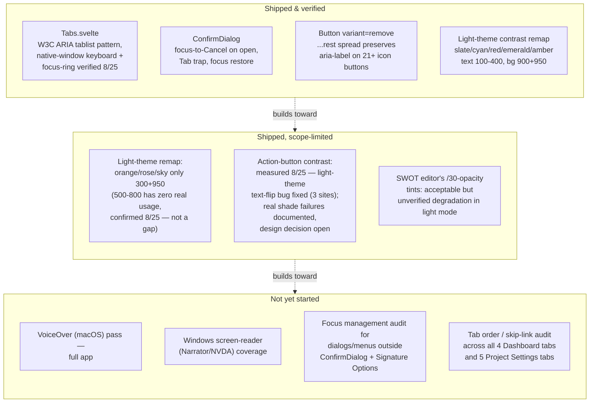

<!--
SPDX-FileCopyrightText: 2026 James L. Burns and The GoPMgr Contributors
SPDX-License-Identifier: GFDL-1.3-or-later
-->

# Accessibility — coverage map and remaining work

**Status:** Planning document, 2026-08-24; updated 2026-08-25 — M1 (native
keyboard-only pass of `Tabs.svelte`'s two consumers) fully closed, in both
the browser-tab and native-window runtimes; action-button contrast (item 5)
measured, one real bug fixed, one design decision referred to the user. Maps
what accessibility work has
already shipped against what remains, so the two stop being tracked only as
scattered "verification owed" footnotes across `docs/beta-release-backlog.md`
and `session-notes.md`. No implementation in this document — it is the
design/map/plan deliverable ROADMAP.md's "Accessible, keyboard-complete
workflows before broad release" goal has not yet had.

## 1. Why this document exists

Accessibility work has happened incrementally across many unrelated sessions
(light-theme contrast remapping in June, `ConfirmDialog` focus trapping, the
`Tabs.svelte` ARIA tablist built for the Dashboard/Project-Settings IA
restructuring in August). Each was verified and closed in its own backlog
row, but no single place answers "what accessible-interaction coverage does
the app have today, and what's still missing before the ROADMAP's
keyboard-complete/assistive-technology goal is met." This document is that
place. It is a map, not an audit: the rows below are drawn from this
session's grep of `session-notes.md` and `docs/beta-release-backlog.md`, not
from a fresh WCAG pass over the running app.

## 2. Coverage map

## 3. Detail table

| Area | State | Evidence | Gap / next step |
|---|---|---|---|
| Tab navigation (`Tabs.svelte`) | Shipped; fully verified 2026-08-25 | 8 dedicated component tests for keyboard mechanics (`docs/beta-release-backlog.md` Priority #3 R3/R4 row); a 2026-08-25 real-browser pass against the `wails dev` asset server (`http://localhost:34115`, IPC bridge live) confirming trusted OS-level ArrowRight/ArrowLeft/Home/End/Tab keydowns, wraparound both directions, ARIA state, and live `:focus-visible` rendering in both themes; **and, later the same day, a native-window pass through computer-use against the actually-launched `gopmgr.app`** (real macOS window chrome, no browser involved): clicked into each consumer's tablist, then drove ArrowRight through the full cycle plus wraparound in both directions, Home, End, and Tab on both Dashboard's 4 tabs and Project Settings' 5, screenshotting and zooming after each keypress to visually confirm the correct tab activates and a real focus ring renders (the exact `outline: 2px solid` rule from `app.css`), and that Tab exits the tablist into its panel rather than cycling. Zero defects found in either runtime. | None open. Both halves of the plan's original acceptance criterion — "DOM assertions correspond to real focus rings" and "native window chrome doesn't intercept arrow/Tab keys" — are now independently confirmed, in two different runtimes. |
| Confirmation dialogs (`ConfirmDialog`) | Shipped | 12 component tests, fault-seeded initial-focus check | Help text explicitly scopes this guarantee to `ConfirmDialog`-family and Signature Options only — other custom dialogs/menus (chart editors, document editors) are unaudited for the same focus-trap/restore behavior. |
| Icon-only buttons (`Button variant="remove"`) | Shipped | 21 of an unknown larger population of icon buttons migrated with `aria-label` preserved via `...rest` spread. **Correction, 2026-08-25**: this row previously stated `WorkflowEditor`/`ActivityEditor`/`CPMEditor` were "explicitly deferred," carrying forward `beta-release-backlog.md` row 56's 2026-08-18 exclusion reason verbatim into this plan (written 2026-08-24) without re-checking whether it still held. It didn't: those three were actually migrated the very next day (2026-08-19), leaving only their `remove`-variant buttons' *reachability testing* unclosed, not the migration itself — a re-verification failure, not a timing accident, and the same failure mode this correction itself almost repeated before a completeness grep caught it. That reachability gap is now closed across all four `variant="remove"` sites in the trio (`ActivityEditor`'s "Delete edge" and "Remove swimlane," `WorkflowEditor`'s "Delete edge," `CPMEditor`'s "Remove assignment" — `ActivityEditor.test.ts`/`WorkflowEditor.test.ts`/`CPMEditor.test.ts`, 2026-08-25) — and writing the reachable test for "Remove assignment" surfaced a real, independent defect: it had `title` but no `aria-label`, so its computed accessible name came from its bare `✕` text content, not the title, unlike its three siblings. Fixed with a one-line `aria-label` addition, fault-seeded. | None open for this specific trio, confirmed by grep for `variant="remove"` across all three files (not assumed from the original 2-3 sites named). The broader "unknown larger population of icon buttons" beyond the 21 already migrated remains unquantified — a fresh app-wide grep would be needed to know if any remain. |
| Light-theme color contrast | Shipped for core semantic colors; action-button shades independently measured 2026-08-25, light-theme text-flip bug fixed | `frontend/tailwind.config.js` + `app.css` CSS-variable remap for slate/cyan/red/emerald/amber; **2026-08-25 measurement** (real Tailwind v4.3.3 `npm run build` output, WCAG 2.1 SC 1.4.3 formula, every real `bg-{red,emerald,amber}-[5678]00` call site in `frontend/src`) replaced the "reasoned as sufficient" claim with actual numbers — see `docs/beta-release-backlog.md`'s "Independently measure the action-button..." row for the full ranked findings and file:line table below. | orange/rose/sky have **zero real 500-800 usage** (scope correction — the six-color framing below was wrong by half); of the real usage (red/emerald/amber), several combinations genuinely fail AA at rest, in both themes, regardless of text-color choice (`emerald-600`/`amber-600` with white text, including `Button.svelte`'s shared `caution` variant's hover state) — this is a **design decision** (darken the shade vs. restrict to non-text use) referred to the user, not yet made. The 3 sites where the failure was purely the app's ambient text flipping dark against a fixed background (`bg-emerald-800`/`amber-800` with no explicit text color) were fixed by adding `text-white`. SWOT's transparency tints remain unverified (alpha-compositing math not yet done). |
| Action-button contrast — measured detail (2026-08-25) | See ranked table | **Bucket A — fixed this cycle** (ambient text on a fixed-color background that flips dark only in light theme; `text-white` fully fixes both rest and hover, both themes): `CharterEditor.svelte:265` (`bg-amber-800 hover:bg-amber-700`, dark 5.78:1/4.09:1 → light 2.05:1/2.90:1 before fix; 7.13:1/5.05:1 after, both themes), `CharterEditor.svelte:282` and `Dashboard.svelte:564` (`bg-emerald-800 hover:bg-emerald-700`, same shape; 7.71:1/5.43:1 after, both themes). All three now carry explicit `text-white`.  **Bucket B — `text-white` would only partially fix; not applied, needs a decision**: `SprintList.svelte:328` (`bg-emerald-700 hover:bg-emerald-600`, ambient text). Rest state fails both themes today (4.40:1 dark, 2.70:1 light) and `text-white` would fix it (5.43:1) — but the **hover** state (`emerald-600`) would still fail even with white text (3.73:1), so this site can't be closed by the same one-line fix as Bucket A; it needs either a hover-shade change or accepting a still-failing hover.  **Bucket C — `text-white` does not help at all; needs a real shade/design decision**: `bg-emerald-600` + white text, 3.73:1 rest / 2.50:1 hover (`SignCertificateModal.svelte:254`, `CharterEditor.svelte:326`, `SigmaProjectView.svelte:265`); `bg-emerald-600` ambient, fails both themes at rest regardless of text color (`SigmaProjectView.svelte:532`); `bg-emerald-600` + white text, **no hover variant** — the current-phase indicator's permanent resting state, 3.73:1 always (`SigmaPhaseStepper.svelte:55`); `bg-amber-600` + white text, 3.20:1 rest / 2.15:1 hover (`SigmaFishbone.svelte:174`); `Button.svelte:78`'s shared `caution` variant's hover state (`amber-600`, 3.20:1) — rest (`amber-700`) passes at 5.05:1, only hover fails, but this cascades to every `variant="caution"` button app-wide (`AppSettings.svelte:383`, `AdminPanel.svelte:338`); `bg-red-500` + white text hover, 3.81:1 (`ProjectPicker.svelte:199`, rest `red-600` passes at 4.87:1).  Passing, no action needed: `red-700`/`red-600`+white (6.52/4.87 both states), `emerald-700`+white (5.43), `amber-700`+white (5.05), `Button.svelte`'s `danger` variant (rest+hover both pass). Excluded, different pattern: progress-bar/stepper fills with no text overlay (`BudgetPanel.svelte:100`, `DORADashboard.svelte:119-122`, `SigmaPhaseStepper.svelte:77` — non-text contrast, SC 1.4.11 not SC 1.4.3, not measured here); `Portfolio.svelte:66,68,70`'s `/20`-opacity badge tints and `ProjectPicker.svelte:222`'s `hover:bg-red-600/80` translucent overlay (need alpha-compositing math, not done). Methodology: ratios use Tailwind v4's sRGB hex fallback, correct for standard-gamut displays; a wide-gamut (P3) display uses Tailwind's `lab(...)` value instead and would compute a different ratio. |
| Cross-platform AT coverage | Not started | `docs/beta-release-backlog.md`'s Cost Control and keyboard-coverage rows both explicitly close with "Native Windows, VoiceOver, and keyboard-only coverage remain planned separately" | This is the largest concrete gap against the ROADMAP goal. No VoiceOver, Narrator, or NVDA pass has been run against any version of this app to date, per the available records. |

## 4. Recommended next accessibility work item

In priority order, scoped to be independently completable:

1. ~~**Native keyboard-only pass of `Tabs.svelte`'s two consumers**~~ — **fully
   closed 2026-08-25.** Split earlier the same day into two halves (browser
   focus-ring verification vs. native window-chrome key interception); a
   same-session attempt to close the second half via computer-use was
   initially denied at the access prompt, then explicitly re-granted by the
   user later the same day. With access granted, both consumers were driven
   through the real, launched `gopmgr.app` window — not a browser tab — with
   real hardware keys, screenshotted and zoomed after each keypress to
   visually confirm the rendered focus ring. See the detail table row above
   for the full evidence. No defects found; nothing left open on this item.
2. ~~**Finish the `Button variant="remove"` migration** for the three
   explicitly-deferred editors, each behind its own small test.~~ —
   **closed 2026-08-25**, see the detail table row above; the premise was
   partly stale (migration itself was already done), the real remaining gap
   (reachability tests, plus one genuine accessible-name defect found along
   the way) is now closed.
3. **VoiceOver smoke pass** covering sign-in, project creation, and one
   document/one chart editor — the three flows every user touches first.
4. **Focus-trap/restore audit of the remaining custom dialogs and menus**
   outside the `ConfirmDialog` family, using the same pattern already proven
   there rather than inventing a new one.
5. ~~**Independent AA contrast measurement of the six action-button shades**
   (500-800 across red/emerald/amber/orange/rose/sky) reasoned-but-not-measured
   in the June remap.~~ — **measured 2026-08-25**; see the detail table row
   above. Scope was actually red/emerald/amber only (orange/rose/sky have no
   real usage at these shades). Findings split into three buckets: **A**
   (light-theme-only text-flip bug, 3 sites) — **fixed**, a one-line
   `text-white` addition, no design tradeoff. **B** (`SprintList.svelte:328`)
   — `text-white` would fix its rest state but not its hover state; not
   applied pending a decision on the hover shade. **C** (`emerald-600`/
   `amber-600`/`red-500` failing at rest or on hover regardless of text
   color, including the shared `Button.svelte` `caution` variant's hover
   state) — a real brand-color decision (darken the shade vs. restrict to
   non-text use), referred to the user per this project's established
   precedent for visible design changes, not decided unilaterally. **This is
   now the next work item**: get the Bucket B/C decision, then implement +
   verify.

Windows/NVDA coverage is deliberately not item 1 — it requires a Windows
host this environment does not have, and should be scheduled once the
macOS-side gaps above are closed so any shared component-level fix isn't
duplicated across two coverage passes.

## 5. Explicitly out of scope for this document

Per the go-high-assurance workflow's scope discipline, this document plans
and maps only. It does not audit the running app, does not fix any of the
gaps above, and does not run a Penpot accessibility-token or contrast audit
— those are the `penpot-audit-accessibility` skill's job, to be invoked
against a design once one exists to audit, or against this coverage map in a
future session focused specifically on accessibility.
