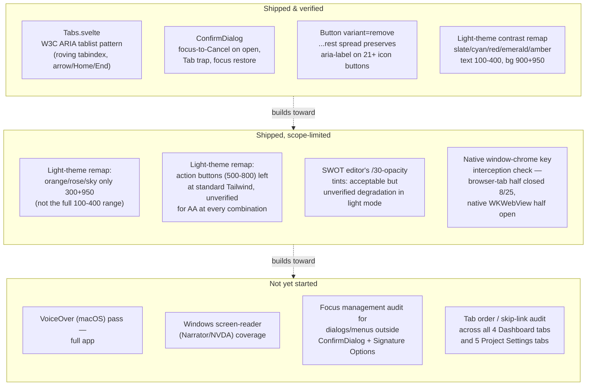

<!--
SPDX-FileCopyrightText: 2026 James L. Burns and The GoPMgr Contributors
SPDX-License-Identifier: GFDL-1.3-or-later
-->

# Accessibility — coverage map and remaining work

**Status:** Planning document, 2026-08-24; updated 2026-08-25 with the M1
verification split (browser-tab half closed, native-window-chrome half
open). Maps what accessibility work has
already shipped against what remains, so the two stop being tracked only as
scattered "verification owed" footnotes across `docs/beta-release-backlog.md`
and `session-notes.md`. No implementation in this document — it is the
design/map/plan deliverable ROADMAP.md's "Accessible, keyboard-complete
workflows before broad release" goal has not yet had.

## 1. Why this document exists

Accessibility work has happened incrementally across many unrelated sessions
(light-theme contrast remapping in June, `ConfirmDialog` focus trapping, the
`Tabs.svelte` ARIA tablist built for the Dashboard/Project-Settings IA
restructuring in August). Each was verified and closed in its own backlog
row, but no single place answers "what accessible-interaction coverage does
the app have today, and what's still missing before the ROADMAP's
keyboard-complete/assistive-technology goal is met." This document is that
place. It is a map, not an audit: the rows below are drawn from this
session's grep of `session-notes.md` and `docs/beta-release-backlog.md`, not
from a fresh WCAG pass over the running app.

## 2. Coverage map

## 3. Detail table

| Area | State | Evidence | Gap / next step |
|---|---|---|---|
| Tab navigation (`Tabs.svelte`) | Shipped; focus-ring half confirmed 2026-08-25 | 8 dedicated component tests for keyboard mechanics (`docs/beta-release-backlog.md` Priority #3 R3/R4 row) **plus** a 2026-08-25 real-browser pass against the `wails dev` asset server (`http://localhost:34115`, IPC bridge live): trusted OS-level ArrowRight/ArrowLeft/Home/End/Tab keydowns (not synthetic `dispatchEvent`) fired against a JS-pre-focused tab in both consumers (Dashboard's 4, Project Settings' 5), confirming wraparound both directions, `aria-selected`/roving-`tabindex` state, `document.activeElement`, corresponding tabpanel presence, Tab correctly exiting the tablist into its panel (not cycling tabs), **and** live `:focus-visible` match with the exact rendered outline in both themes — dark (default): `solid 2px rgb(34,211,238)` matching `app.css:23`; light (`data-theme="light"`): `solid 2px rgb(14,116,144)` matching `app.css:84` — not just source inspection. Zero defects found. | **Still open, and distinct from what was just closed:** this pass ran in a standard Chromium tab hitting the Wails dev asset server, never the native WKWebView desktop window (no native macOS title bar/chrome was present in the tested runtime). Whether the actual native window shell intercepts or alters arrow/Tab/Home/End delivery before the page sees them — the plan's other original acceptance criterion — remains unverified. Needs either a computer-use pass against the real launched `.app` window, or a manual check at a real keyboard. |
| Confirmation dialogs (`ConfirmDialog`) | Shipped | 12 component tests, fault-seeded initial-focus check | Help text explicitly scopes this guarantee to `ConfirmDialog`-family and Signature Options only — other custom dialogs/menus (chart editors, document editors) are unaudited for the same focus-trap/restore behavior. |
| Icon-only buttons (`Button variant="remove"`) | Shipped, partially | 21 of an unknown larger population of icon buttons migrated with `aria-label` preserved via `...rest` spread; `WorkflowEditor`/`ActivityEditor`/`CPMEditor` explicitly deferred (no test coverage, non-trivial mount state) | Finish the migration or independently confirm the deferred sites already have an accessible name through some other mechanism. |
| Light-theme color contrast | Shipped for core semantic colors | `frontend/tailwind.config.js` + `app.css` CSS-variable remap for slate/cyan/red/emerald/amber; specific AA-failure math recorded for amber-700 | orange/rose/sky got a narrower remap (300+950 only); action-button shades (500-800) were reasoned as "sufficient contrast" but never independently measured; SWOT's transparency tints are disclosed as "acceptable degradation," not verified. |
| Cross-platform AT coverage | Not started | `docs/beta-release-backlog.md`'s Cost Control and keyboard-coverage rows both explicitly close with "Native Windows, VoiceOver, and keyboard-only coverage remain planned separately" | This is the largest concrete gap against the ROADMAP goal. No VoiceOver, Narrator, or NVDA pass has been run against any version of this app to date, per the available records. |

## 4. Recommended next accessibility work item

In priority order, scoped to be independently completable:

1. ~~**Native keyboard-only pass of `Tabs.svelte`'s two consumers**~~ — **split
   2026-08-25.** The "do the DOM assertions correspond to real focus rings"
   half is now closed (see the detail table row above: real trusted
   Arrow/Home/End/Tab keydowns, Tab correctly exiting the tablist into its
   panel rather than cycling tabs, real `:focus-visible` rendering confirmed
   in both the dark default theme and `data-theme="light"`, both consumers,
   zero defects). The "does `wails`'s native window chrome intercept
   arrow/Tab keys before the page sees them" half is **not** closed — it was
   tested through a browser tab against the dev asset server, not the native
   WKWebView desktop window. A same-session attempt to close it via
   computer-use against the
   actually-running `gopmgr.app` (`dev.gopmgr.GoPMgr`) was explicitly denied
   by the user at the access-approval prompt (2026-08-25) — not a technical
   limitation, a stated access boundary. Remains the next item: a manual
   pass at a real keyboard, or a future session with that access granted.
2. **VoiceOver smoke pass** covering sign-in, project creation, and one
   document/one chart editor — the three flows every user touches first.
3. **Focus-trap/restore audit of the remaining custom dialogs and menus**
   outside the `ConfirmDialog` family, using the same pattern already proven
   there rather than inventing a new one.
4. **Finish the `Button variant="remove"` migration** for the three
   explicitly-deferred editors, each behind its own small test.
5. **Independent AA contrast measurement of the six action-button shades**
   (500-800 across red/emerald/amber/orange/rose/sky) reasoned-but-not-measured
   in the June remap.

Windows/NVDA coverage is deliberately not item 1 — it requires a Windows
host this environment does not have, and should be scheduled once the
macOS-side gaps above are closed so any shared component-level fix isn't
duplicated across two coverage passes.

## 5. Explicitly out of scope for this document

Per the go-high-assurance workflow's scope discipline, this document plans
and maps only. It does not audit the running app, does not fix any of the
gaps above, and does not run a Penpot accessibility-token or contrast audit
— those are the `penpot-audit-accessibility` skill's job, to be invoked
against a design once one exists to audit, or against this coverage map in a
future session focused specifically on accessibility.
